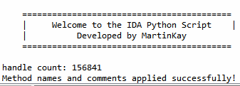
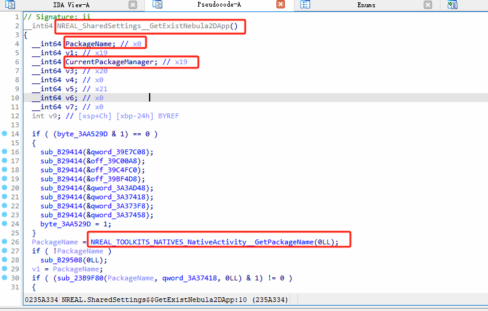

## How to Use
1. Use **Il2CppDumper** to generate the `script.json` file 
   You can find **Il2CppDumper** and more details about it on its GitHub repository: [Il2CppDumper](https://github.com/Perfare/Il2CppDumper/).

2. Clone this repository and load the Python script in IDA Pro.

3. When prompted, select the `script.json` file generated by **Il2CppDumper**.

4. The script will automatically parse the file and apply the appropriate renaming and comments to the methods in IDA.

## Requirements
- **IDA Pro** (version 7.x or later)
- **Il2CppDumper** for generating the `script.json` file: [GitHub](https://github.com/Perfare/Il2CppDumper/)

## 如何使用
1. 使用 **Il2CppDumper** 生成`script.json`文件
   关于**Il2CppDumper**你可以去了解一下这个GitHub仓库: [Il2CppDumper](https://github.com/Perfare/Il2CppDumper/).

2. 克隆此存储库并在IDA Pro中加载Python脚本。

3. ida pro左上角选择文件→脚本文件，先选我的py文件再选`script.json`文件（没用Il2CppDumper的先去dump了才有script.json）。

4. 脚本将自动解析文件，IDA会卡住开始处理，对IDA中的方法应用适当的重命名和注释。

## 要求
- **IDA Pro** (版本要 7.x 或者更高的版本)
- **Il2CppDumper** 用于生成 `script.json` 文件: [GitHub](https://github.com/Perfare/Il2CppDumper/)

## handled

## result
